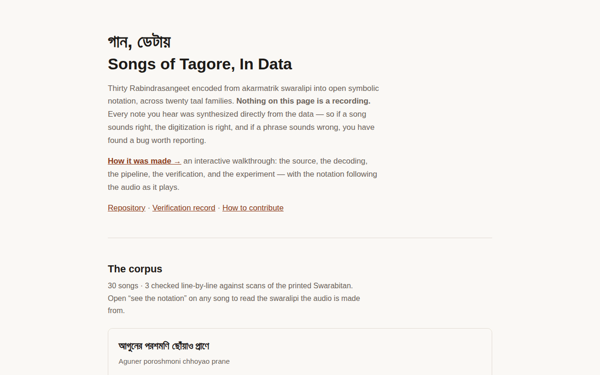
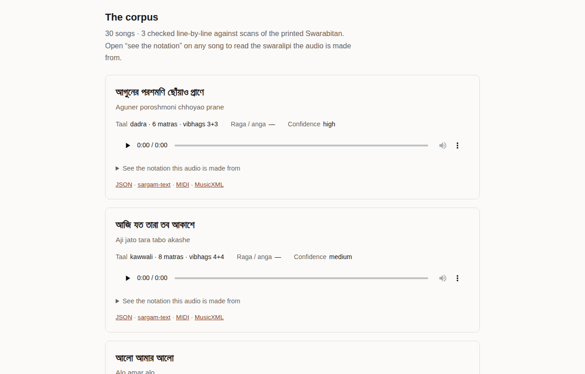
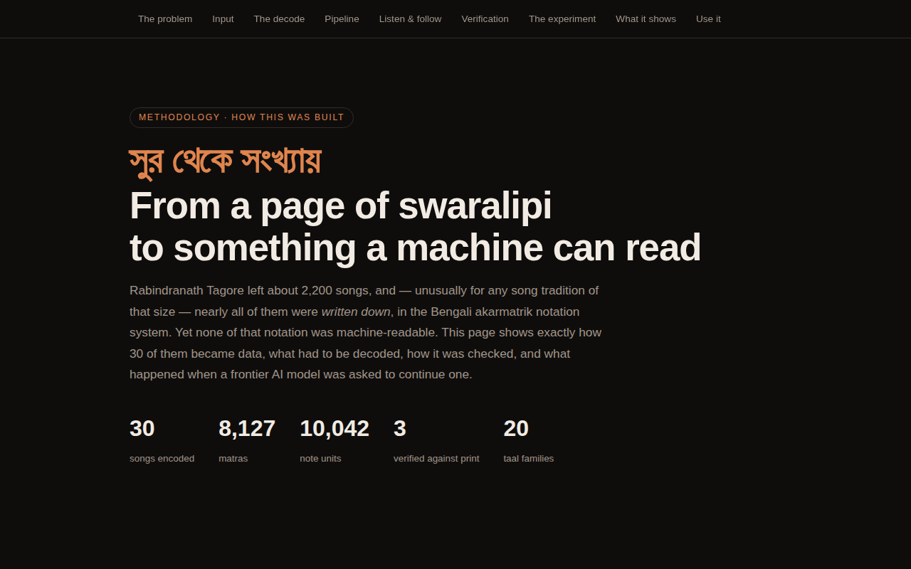
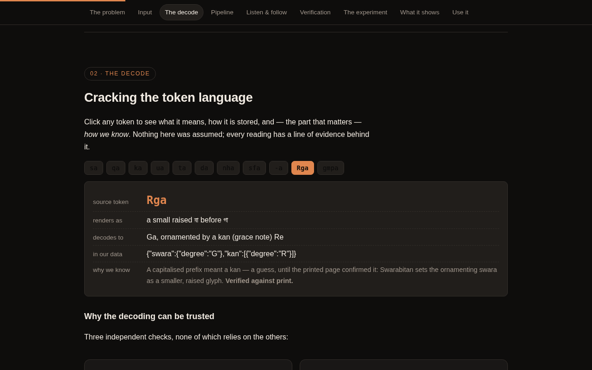
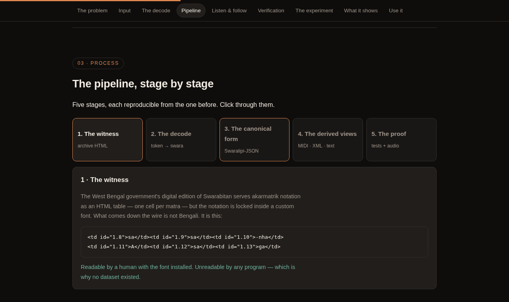
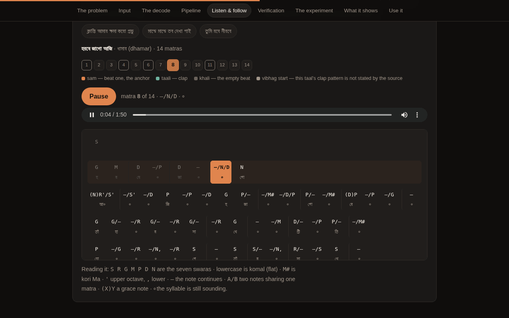
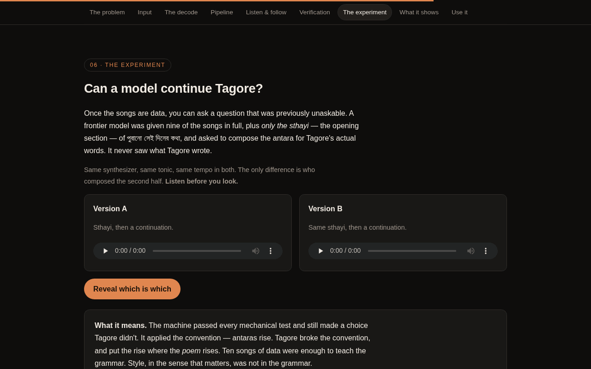
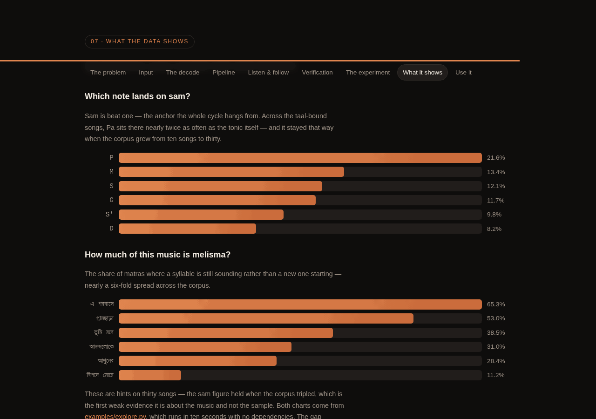
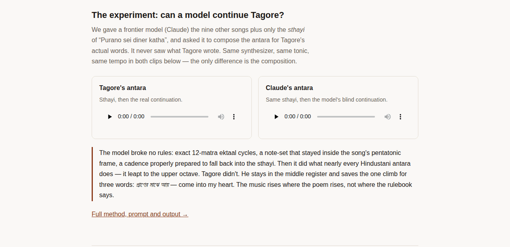

# গান, ডেটায় — Songs of Tagore, In Data

[](https://github.com/indranilbanerjee/tagore-swaralipi/actions/workflows/validate.yml)
[](LICENSE)
[](LICENSE)
[](data/songs)
[](docs/DATASET_CARD.md)
[](schema/SCHEMA.md)

**An open dataset of Rabindrasangeet swaralipi in machine-readable symbolic notation — to our knowledge the first of its kind — now 30 songs across 20 taal families, plus one experiment: a frontier AI model composing a continuation of a Tagore song, in-grammar, with audio.**

**[🎧 Listen to all 30](https://indranilbanerjee.github.io/tagore-swaralipi/)** · **[🛠 See how it was made](https://indranilbanerjee.github.io/tagore-swaralipi/method.html)** · **[📦 Latest release](https://github.com/indranilbanerjee/tagore-swaralipi/releases/latest)** · **[🧪 The AI experiment](experiment/EXPERIMENT.md)** · **[💖 Sponsor](https://github.com/sponsors/indranilbanerjee)**

> **Can you read swaralipi?** You are who this project needs most, and you don't need to write a
> line of code. See [how to verify a song](CONTRIBUTING.md#1-verify-a-song-against-the-printed-swarabitan) —
> it takes ten minutes, and you'll be credited in the data itself.

Rabindranath Tagore left behind roughly 2,200 songs, and — almost uniquely among song traditions of that scale — nearly all of them were *notated*, in the akarmatrik swaralipi system, across the ~64 volumes of **Swarabitan**. That notation has been in the public domain in India since 1 January 2002. Yet in 2026, if you want to compute over Rabindrasangeet — study its melodic grammar, train a model on it, analyse how Tagore bent a Scots air into a khemta — there is no open symbolic dataset. The notation exists as page scans and font-locked websites. This repository is a small, careful first move against that gap.

## Try it live

Two pages, both built from the data in this repo and served free by GitHub Pages. No install and no sign-in.
Click any picture to open that part of the page.

<table>
<tr>
<td width="50%" valign="top">
<a href="https://indranilbanerjee.github.io/tagore-swaralipi/"></a><br>
<b><a href="https://indranilbanerjee.github.io/tagore-swaralipi/">Listening page</a></b><br>
<sub>All 30 songs, each with a player, taal, confidence and links to its JSON, sargam-text, MIDI and MusicXML.</sub>
</td>
<td width="50%" valign="top">
<a href="https://indranilbanerjee.github.io/tagore-swaralipi/"></a><br>
<b><a href="https://indranilbanerjee.github.io/tagore-swaralipi/">Every song, next to its notation</a></b><br>
<sub>Open “see the notation” on any song to read the swaralipi the audio is made from.</sub>
</td>
</tr>
<tr>
<td width="50%" valign="top">
<a href="https://indranilbanerjee.github.io/tagore-swaralipi/method.html"></a><br>
<b><a href="https://indranilbanerjee.github.io/tagore-swaralipi/method.html">How it was made: interactive walkthrough</a></b><br>
<sub>From a font-locked archive page to data a machine can read, in nine sections.</sub>
</td>
<td width="50%" valign="top">
<a href="https://indranilbanerjee.github.io/tagore-swaralipi/method.html#decode"></a><br>
<b><a href="https://indranilbanerjee.github.io/tagore-swaralipi/method.html#decode">The decoder</a></b><br>
<sub>Click any source token to see what it means, how it is stored, and the evidence for the reading.</sub>
</td>
</tr>
<tr>
<td width="50%" valign="top">
<a href="https://indranilbanerjee.github.io/tagore-swaralipi/method.html#pipeline"></a><br>
<b><a href="https://indranilbanerjee.github.io/tagore-swaralipi/method.html#pipeline">The pipeline, stage by stage</a></b><br>
<sub>Witness → decode → canonical JSON → MIDI/MusicXML/text → tests and audio. Click through each stage.</sub>
</td>
<td width="50%" valign="top">
<a href="https://indranilbanerjee.github.io/tagore-swaralipi/method.html#follow"></a><br>
<b><a href="https://indranilbanerjee.github.io/tagore-swaralipi/method.html#follow">The notation follower</a></b><br>
<sub>Press play: the current matra lights up while the taal cycle turns underneath. Shown: a 14-matra dhamar.</sub>
</td>
</tr>
<tr>
<td width="50%" valign="top">
<a href="https://indranilbanerjee.github.io/tagore-swaralipi/method.html#experiment"></a><br>
<b><a href="https://indranilbanerjee.github.io/tagore-swaralipi/method.html#experiment">Blind A/B test: Tagore or the model?</a></b><br>
<sub>Same sthayi, same synthesizer. Listen to both antaras, guess, then reveal.</sub>
</td>
<td width="50%" valign="top">
<a href="https://indranilbanerjee.github.io/tagore-swaralipi/method.html#findings"></a><br>
<b><a href="https://indranilbanerjee.github.io/tagore-swaralipi/method.html#findings">What the data shows</a></b><br>
<sub>Which note lands on sam, how much of the music is melisma: questions that were not answerable before.</sub>
</td>
</tr>
</table>

**Jump straight to a section of the walkthrough:**
[the problem](https://indranilbanerjee.github.io/tagore-swaralipi/method.html#problem) ·
[what we started with](https://indranilbanerjee.github.io/tagore-swaralipi/method.html#input) ·
[the decoder](https://indranilbanerjee.github.io/tagore-swaralipi/method.html#decode) ·
[the pipeline](https://indranilbanerjee.github.io/tagore-swaralipi/method.html#pipeline) ·
[listen and follow](https://indranilbanerjee.github.io/tagore-swaralipi/method.html#follow) ·
[checking against print](https://indranilbanerjee.github.io/tagore-swaralipi/method.html#verify) ·
[the experiment](https://indranilbanerjee.github.io/tagore-swaralipi/method.html#experiment) ·
[what the data shows](https://indranilbanerjee.github.io/tagore-swaralipi/method.html#findings) ·
[use it](https://indranilbanerjee.github.io/tagore-swaralipi/method.html#use)

**Test it yourself.** Everything on those pages can be checked locally in a minute:

```bash
git clone https://github.com/indranilbanerjee/tagore-swaralipi && cd tagore-swaralipi
python -m http.server 8000          # then open localhost:8000 and localhost:8000/method.html
python examples/explore.py          # five questions over the corpus, no dependencies
pip install -r requirements.txt pytest && python -m pytest tests/   # the 393 checks CI runs
```

If a phrase sounds wrong, or the notation doesn't match your Swarabitan, that's a real bug.
[Report it here](../../issues/new?template=notation-correction.yml).

## What's here

| Path | Contents |
|---|---|
| `data/songs/` | 30 songs in **Swaralipi-JSON** — the canonical, akarmatrik-faithful encoding (swara + saptak + matra-fraction + taal cycle + Bengali lyric alignment + provenance) |
| `data/text/` | The same 30 songs as human-readable **sargam-text** (round-trip verified) |
| `derived/midi/`, `derived/musicxml/` | Auto-derived MIDI and MusicXML views (lossy by design; the JSON is canonical) |
| `audio/` | Reference audio synthesized *purely from the notation* — no recordings involved |
| `schema/` | `SCHEMA.md` (design rationale) and a JSON Schema validator |
| `tools/` | The full pipeline: witness fetcher, parser, validators, converters, synthesizer — every file in `data/` is reproducible from the cited sources |
| `docs/DECODING.md` | How the source archive's font-encoded notation was decoded, with the cross-source triangulation evidence |
| `docs/DATASET_CARD.md` | Formal dataset card — coverage, intended uses, limitations, rights, prior art |
| `docs/VERIFICATION.md` | What was checked against the printed Swarabitan, what matched, and what it corrected |
| `docs/USE_CASES.md` | What this data makes possible — with real findings measured on the corpus, and open research questions |
| `ROADMAP.md` | What v0.2 / v0.3 / v0.5 / v1.0 contain, what's **help wanted**, and what we've decided *not* to do |
| `examples/` | Runnable exploration script — five questions answered over the corpus, no dependencies |
| `experiment/` | **"Claude continues Tagore"** — a blind composition experiment with A/B audio ([writeup](experiment/EXPERIMENT.md)) |
| `index.html` | The [listening page](https://indranilbanerjee.github.io/tagore-swaralipi/) — notation beside audio, built by `tools/build_site.py` |
| `method.html` | The [interactive methodology walkthrough](https://indranilbanerjee.github.io/tagore-swaralipi/method.html) — decoder, pipeline, notation follower, blind listening test. Generated from the corpus by `tools/build_method_page.py` |
| `docs/img/` | Screenshots of both live pages, used in this README |
| `sources/catalogue.json` | A map of **all 1,568 songs** in the witness archive that carry notation — taal, parjaay and URL for each. Built by `tools/discover_songs.py`; this is where the next songs come from |
| `tests/` | 393 integrity checks — schema, taal arithmetic, provenance, lossless round-trip. Run in CI on every PR |

## The songs

30 songs, chosen so the corpus is a **structural sample of the tradition** rather than a
list of favourites — 20 taal families, both bhanga gaan and Rabindrik taals, and songs
people actually sing.

| Taal | Matras | Songs |
|---|---|---|
| ektaal · একতাল | 12 | পুরানো সেই দিনের কথা · আনন্দলোকে · তুমি রবে নীরবে · মাঝে মাঝে তব দেখা পাই · আমি চিনি গো চিনি |
| dadra · দাদরা | 6 | একলা চলো রে · আগুনের পরশমণি · আলো আমার আলো · ক্লান্তি আমার ক্ষমা করো · ভেঙে মোর ঘরের চাবি |
| kaharba · কাহারবা | 8 | গ্রামছাড়া ওই রাঙা মাটির পথ · **জনগণমন-অধিনায়ক** |
| tintal · তিনতাল | 16 | এসো শ্যামল সুন্দর |
| khemta · খেমটা | 6 | ফুলে ফুলে ঢ'লে ঢ'লে |
| **talamukta** · তালমুক্ত | free | ভালোবেসে সখী · এমন দিনে তারে বলা যায় |
| teora · তেওড়া | 7 | আমার মাথা নত করে দাও |
| jhanp · ঝাঁপ | 10 | বহে নিরন্তর অনন্ত আনন্দধারা |
| jhampak · ঝম্পক | 5 | বিপদে মোরে রক্ষা করো |
| sasthi · ষষ্ঠী | 6 | চিরবন্ধু চিরনির্ভর চিরশান্তি |
| kawwali · কাওয়ালি | 8 | আজি যত তারা তব আকাশে |
| dhamar · ধামার | 14 | হরষে জাগো আজি |
| surfank · সুরফাঁক | 10 | প্রতিদিন তব গাথা গাব আমি |
| chautal · চৌতাল | 12 | জাগিতে হবে রে |
| ardha-jhanp · অর্দ্ধঝাঁপ | 5 | পথে চলে যেতে যেতে |
| madhyaman · মধ্যমান | 16 | এ পরবাসে রবে কে হায় |
| rupak · রুপক | 7 | আমার প্রাণে গভীর গোপন |
| rupakra · রুপকড়া | 8 | গভীর রজনী নামিল হৃদয়ে |
| arathheka · আড়াঠেকা | 16 | পথ চেয়ে যে কেটে গেল |
| dadra, 5-matra setting | 5 | কৃষ্ণকলি আমি তারেই বলি *(taal conflict recorded — see its confidence notes)* |

Twenty taal families, two free-rhythm songs, two bhanga gaan built on Scottish airs, and the Indian national anthem. The rare Rabindrik taals — ঝম্পক, ষষ্ঠী, রূপকড়া, সুরফাঁক — matter more than they look: they are the ones no Western-derived format can hold, and the ones a corpus of famous songs alone would miss entirely.

## Why a *symbolic* dataset matters

Audio corpora of Rabindrasangeet exist. But audio entangles the composition with a performance. The swaralipi is the composition itself — what Tagore (via his notators: Jyotirindranath Tagore, Dinendranath Tagore, Indira Devi Chaudhurani and others) fixed on the page. Symbolic data is what lets you ask: *what are the grammar rules of this music?* Which taals carry which cadence idioms? How does a Behag song treat kori Ma? What did Tagore change when he took a pentatonic Scots tune into ektaal? Every one of those questions becomes a query over this JSON.

And for the machine-learning era there is a sharper reason: **models learn the grammar of what they can read.** Western music has centuries of digitized scores; Rabindrasangeet has essentially none. A tradition absent from the data is absent from the models. This dataset is 30 songs — about 1.4% of the songbook. The witness archive carries notation for **1,568** of them (`sources/catalogue.json`), so the ceiling is not the data; it is the verification.


## Listen — every note here is synthesized from the notation

**🎧 [Open the listening page](https://indranilbanerjee.github.io/tagore-swaralipi/)** — all thirty songs with players, each next to the swaralipi
the audio is made from, plus the AI experiment side by side.

**🛠 [How it was made — interactive walkthrough](https://indranilbanerjee.github.io/tagore-swaralipi/method.html)** —
the source, the token decoding (click any token to see what it means and how we know), the
five-stage pipeline, the verification against printed Swarabitan, and the experiment as a blind
listening test. Its centrepiece is a **notation follower**: press play and the current matra lights
up while the taal cycle turns beneath it — sam, taali, khali — so you can watch the rhythm being
counted instead of taking it on faith.

Nothing in `audio/` is a recording. Each file was generated from the JSON in `data/songs/`, so it
is a direct audible test of the digitization: if a song sounds right, the data is right, and if a
phrase sounds wrong, you have found a bug worth [reporting](../../issues/new?template=notation-correction.yml).

| | Listen | Read the notation |
|---|---|---|
| পুরানো সেই দিনের কথা — *ektaal, Mishra Bhupali* | [▶ play](https://raw.githubusercontent.com/indranilbanerjee/tagore-swaralipi/main/audio/purano-sei-diner-katha.mp3) | [sargam-text](data/text/purano-sei-diner-katha.txt) |
| যদি তোর ডাক শুনে (একলা চলো রে) — *dadra, Baul sur* | [▶ play](https://raw.githubusercontent.com/indranilbanerjee/tagore-swaralipi/main/audio/ekla-chalo-re.mp3) | [sargam-text](data/text/ekla-chalo-re.txt) |
| তুমি রবে নীরবে — *ektaal, Behag* | [▶ play](https://raw.githubusercontent.com/indranilbanerjee/tagore-swaralipi/main/audio/tumi-robe-nirobe.mp3) | [sargam-text](data/text/tumi-robe-nirobe.txt) |
| ভালোবেসে সখী — *talamukta (free rhythm)* | [▶ play](https://raw.githubusercontent.com/indranilbanerjee/tagore-swaralipi/main/audio/bhalobese-sokhi.mp3) | [sargam-text](data/text/bhalobese-sokhi.txt) |
| এসো শ্যামল সুন্দর — *tintal, Desh* | [▶ play](https://raw.githubusercontent.com/indranilbanerjee/tagore-swaralipi/main/audio/esho-shyamalo-sundoro.mp3) | [sargam-text](data/text/esho-shyamalo-sundoro.txt) |

*(all thirty are in [`audio/`](audio) — the five above are a spread across the taal families)*

### The experiment, A/B

Same sthayi, same synthesizer, same tonic. The only difference is who wrote the second half.

<a href="https://indranilbanerjee.github.io/tagore-swaralipi/"></a>

| | |
|---|---|
| **Tagore's antara** | [▶ play](https://raw.githubusercontent.com/indranilbanerjee/tagore-swaralipi/main/experiment/purano_real_sthayi_antara.mp3) |
| **Claude's antara**, composed blind | [▶ play](https://raw.githubusercontent.com/indranilbanerjee/tagore-swaralipi/main/experiment/purano_claude_continuation.mp3) |

Could you pick which is his? The [writeup](experiment/EXPERIMENT.md) explains what the model got
right — and the one thing it got conventionally, where Tagore did not.


## What you can do with it

Once notation is data, questions that needed sixty volumes and a lifetime become a few lines of
Python. Run [`examples/explore.py`](examples/explore.py) — no dependencies, ten seconds — and it
will tell you, among other things, that **Pa sits on sam nearly twice as often as Sa** (21.6% against
12.1%) across this corpus, that a handful of four-note interval shapes recur in 23–27 of the thirty
songs, and that melisma density ranges from 11% to 65% of matras between songs.

Those are hints on thirty songs — and they held when the corpus tripled, which is the first weak
evidence that they are about the tradition and not about the sample. On five hundred they would be
findings. The gap between those two
sentences is what this project is for.

[`docs/USE_CASES.md`](docs/USE_CASES.md) lays out the rest: comparative analysis of Tagore's
*bhanga gaan* against the Scottish and Hindustani tunes he reworked; whether individual notators
have detectable fingerprints; search that cannot exist today ("songs in dadra that use kori Ma");
practice tools at any tonic; Braille and screen-reader output for blind musicians; and the idea I
would most like someone to take — turning the continuation experiment into a **benchmark that
distinguishes following the rules from understanding the idiom**, which this repertoire is
unusually well suited to supply.

## Provenance and licensing — read this before reusing

- **Compositions**: Rabindranath Tagore (d. 1941). His works entered the Indian public domain on 1 January 2002; the government explicitly declined to extend Visva-Bharati's term in 2001.
- **Primary witness**: the [SNLTR Rabindra Rachanabali digital edition](https://rabindra-rachanabali.nltr.org/) (Govt. of West Bengal), itself a digitization of Swarabitan. This dataset **re-encodes the musical facts** — pitches, durations, taal structure, lyrics of public-domain songs — into an original schema; it redistributes nothing from any witness — no page images, no fonts, no HTML, no typographical arrangement. The witness pages are fetched on demand by `tools/fetch_sources.py` and are git-ignored (see [`sources/README.md`](sources/README.md)). Per-song witness URLs, retrieval dates and cross-witness agreement are recorded in each file's `provenance` block. Where an independent second witness existed (geetabitan.com metadata, romanized sargam archives), agreement is noted.
- **This is v0.2, archive-derived.** 3 of the 30 songs have been checked against first-edition Swarabitan page scans (Internet Archive holds several volumes); verifying the other 27 is the whole of v0.3. Each file carries an honest `confidence` block; corrections are welcome and wanted — that is what the issue tracker is for.
- **License**: data (`data/`, `derived/`, `audio/`) **CC BY 4.0**; code (`tools/`, `schema/`) **MIT**. Cite as in `CITATION.cff`.

## Reproduce everything

```bash
pip install -r requirements.txt
python tools/fetch_sources.py    # download the cited witness pages (git-ignored)
python tools/build_dataset.py    # sources/raw HTML -> data/songs/*.json
python tools/validate.py         # JSON Schema + taal arithmetic + note-set report
python tools/render_text.py      # -> data/text (round-trip verified vs parse_text.py)
python tools/to_midi.py          # -> derived/midi
python tools/to_musicxml.py      # -> derived/musicxml
python tools/synth.py            # -> audio (needs ffmpeg)
python tools/build_site.py       # -> index.html (listening page)
python tools/build_method_page.py # -> method.html (interactive walkthrough)
python -m pytest tests/ -v       # 393 integrity checks
```


## How much of this is verified

Three of the thirty songs have been checked **matra by matra against scans of the printed
Swarabitan**, not just against the online archive they were encoded from. That check is written up
in [`docs/VERIFICATION.md`](docs/VERIFICATION.md) with the volume, page and scan URL for each, so
you can repeat it rather than trust it. What it produced:

- **পুরানো সেই দিনের কথা** (vol. 32) — exact match over six lines, *and* the printed header gave us
  a raga the online witness omits: **মিশ্র ভূপালী (Mishra Bhupali)**. Measure the data and the name
  turns out to be exact: **94.1% of the song's 135 notes are the Bhupali pentatonic** (S R G P D);
  the remaining 6% is seven Ni — mostly a lower neighbour to Sa — and a single Ma. *Mishra* means
  *mixed*, and that is precisely what the numbers show. We computed this before the raga name
  reached us, so it is corroboration of the decoding rather than an assumption baked into it.
- **ভালোবেসে সখী** (vol. 56) — exact match, and it **settled a conflict between sources**. A
  secondary source lists this song as dadra; the printed page has no taal header and no vibhag
  bars anywhere, which is how Swarabitan sets a *talamukta* song. Our talamukta reading stands,
  and now says why.
- **গ্রামছাড়া ওই রাঙা মাটির পথ** (vol. 9) — exact match, **one metadata correction** (the anga is
  বাংলা as printed, not the "Baul" we had from tradition), and it validated the corpus's *kan*
  (grace-note) encoding: where we mark a kan, the print sets that swara as a smaller raised
  glyph — the akarmatrik convention. A guess became evidence.

The other twenty-seven remain archive-derived and their `confidence` blocks say so — that ratio
is the honest cost of growing the corpus, and closing it is what v0.3 is for. Volume numbers for
the original seven are already published, so anyone who reads swaralipi can take a row.

## Contributing

**The single most valuable thing anyone can do here is read a Swarabitan page and tell us what we
got wrong.** That needs no programming — see
[CONTRIBUTING.md](CONTRIBUTING.md#1-verify-a-song-against-the-printed-swarabitan). Corrections are
credited by name in the data.

Also wanted: [new songs](CONTRIBUTING.md#2-add-a-song) (especially unusual taals and un-represented
parjaays), [better tooling](CONTRIBUTING.md#3-improve-the-tooling) (akarmatrik rendering, meend-aware
synthesis, format bridges), and [schema work](CONTRIBUTING.md#4-extend-the-schema). Bengali, Hindi
and English are all welcome in issues and discussions.

## The experiment

We gave a frontier LLM (Claude Fable 5) the nine other songs plus only the sthayi of *Purano sei diner katha*, and asked it to compose the antara — melody for Tagore's actual lyrics, in ektaal, in the song's idiom. It returned a continuation with **zero grammar violations** (12-matra cycles exact, note-set inside the song's pentatonic frame, a properly prepared cadence back to the sthayi) — and one deeply revealing *stylistic* divergence from what Tagore actually wrote. The full method, the A/B audio, and what it says about convention versus genius: [`experiment/EXPERIMENT.md`](experiment/EXPERIMENT.md).

## Roadmap

**v0.3** adds no songs. It exists to close the gap v0.2 opened: verify the remaining 27 songs
against the printed Swarabitan, settle the কৃষ্ণকলি taal conflict, decode the 54 unreadable glyphs
and the 22 `i`-form tokens, and add the second setting of মাঝে মাঝে তব দেখা পাই. **v0.4** makes the
notation legible again: an akarmatrik renderer that prints proper Bengali notation from the JSON,
meend as first-class spans, and Bengali-language docs. **v0.5** takes it to fifty songs across all six
parjaays, with a tooling workflow that makes verification cheap. **v1.0** is not a song count. It's
the point where the format is stable and the project no longer depends on any one person.

The rule after v0.2 is that **verification catches up before the corpus grows again.** v0.2 tripled
the song count while the verified count stayed at three, and v0.3 is the correction.

[`ROADMAP.md`](ROADMAP.md) has the detail, including which items are **help wanted**, the open
questions we can't yet answer, and what we've deliberately decided *not* to build.

---

*Built in Bengal's own notation system, for Bengal's own songs, in the open.*
